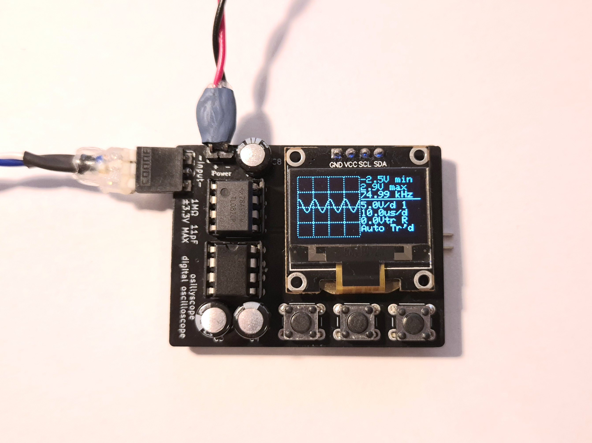
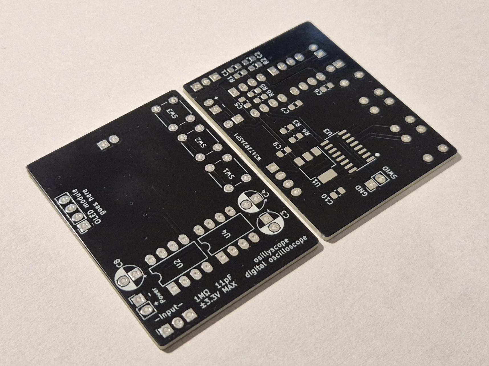

# osillyscope
CH32V003 OLED screen oscilloscope

 **Many thanks to [PCBway](https://www.pcbway.com/) for sponsoring this project with fast high-quality PCB prototyping.**

This is a small digital oscilloscope based around the CH32V003A4M6 RISC-V microcontroller. It uses an SSD1306 I2C OLED display and three pushbuttons for the user interface. Its purpose is to be an inexpensive, easy to build and pocket-sized tool for checking the presence, levels and waveform of an unknown signal. The hardware design focuses on simplicity and low-count bill of materials.

The maximum achievable sample rate is 1.6MSa/s (the time base goes as low as 5us/div). This project proposes a frontend design which allows for a signal input range between -3.3V and +3.3V. The input range can be extended using a standard 10x probe, as the instrument has 1MOhm of input impedance. The bandwidth of the frontend was measured to be around 2.5MHz. 

## Hardware
The schematics and board design files (KiCad 7) are provided in the [hw](hw) folder. Two PCB designs are included: [a 2-layer design, meant to be sent to a PCB fab](hw/osillyscope-2layer/) and [a single layer one, designed to be easily etchable](hw/osillyscope-etchable/).

### **PCBs**

Very shortly after I had published this project, PCBWay reached out to me, offering to try their PCB prototyping services. About a week after placing the order, the boards had arrived, and here are my thoughts on the service they provided:

I'm very pleased with them. They feel dense and solid, I had absolutely no trouble soldering them up. With such a relatively simple, untested board design, I chose to go with HASL finish. While assembling, I had to desolder and resolder the power pin header, and the pads didn't show any signs of possible failure or fatigue (I had that happen often with various circuit boards in the past, but I had no issues with these ones). Visually, I opted for black solder mask. It looks absolutely beautiful, glossy and uniformly coated, honestly the picture above doesn't show it in all of its beauty. The silkscreen is crisp, precise and nicely aligned.

Ordering from them was quite a breeze using their KiCad plugin, which automatically plots and uploads the Gerber files into their ordering platform with a single click. I find their service affordable, I ordered 10 boards (2 layers, 1.6mm with HASL finish) and the price for the boards came to be 5USD.

This was my first experience with PCBWay's prototyping service, and it's been a pleasant one. I will certainly consider them again for my next PCB prototyping needs, and I warmly encourage you too will give them a try.

### Circuitry  
The analog frontend consists of a 2x attenuator, opamp buffer stage and DC offset stage. An ICL7660 voltage converter IC provides the negative supply voltage for the TL082 dual opamp. The oscilloscope can be powered from a 5 or more volts supply, such as a 9V battery.

The schematics are also provided as PDF, in [doc/schematic.pdf](doc/schematic.pdf).

## Code
The firmware source code is provided in the [fw](fw) folder. It uses the [ch32v003fun](https://github.com/cnlohr/ch32v003fun/) framework. This repo must be cloned in the same folder as ch32v003fun repo.

The ADC operates in continuous conversion mode and samples are copied into memory via DMA. Triggering is achieved using the analog watchdog feature of the ADC.
