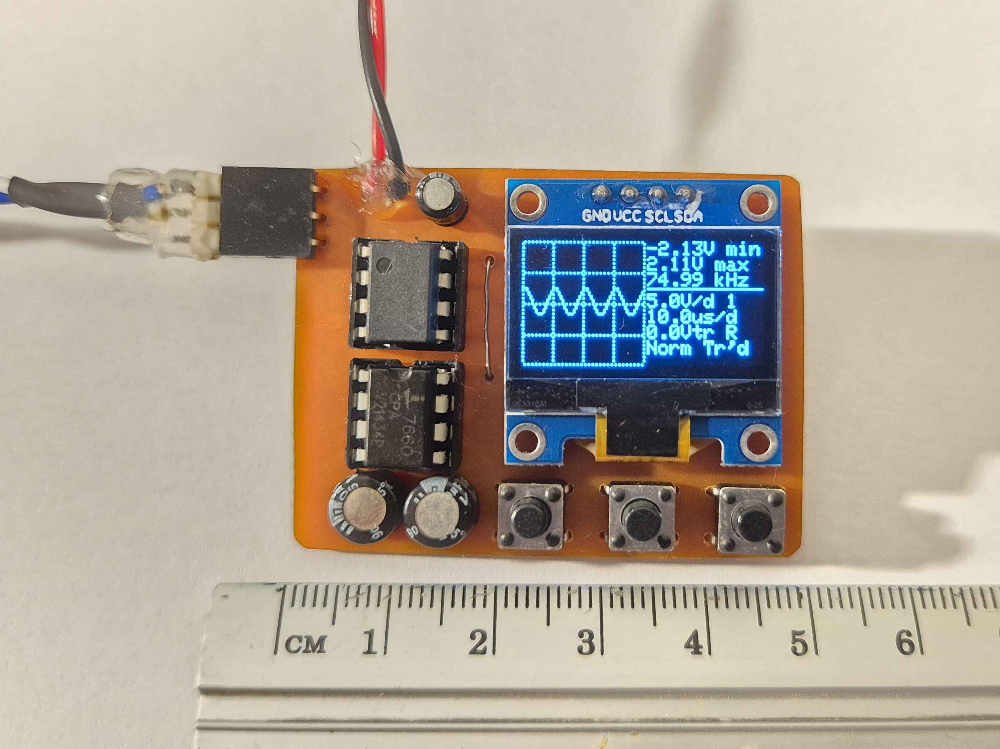

# osillyscope
CH32V003 OLED screen oscilloscope

This is a small digital oscilloscope based around the CH32V003A4M6 RISC-V microcontroller. It uses an SSD1306 I2C OLED display and three pushbuttons for the user interface. Its purpose is to be an inexpensive, easy to build and pocket-sized tool for checking the presence, levels and waveform of an unknown signal. The hardware design focuses on simplicity and low-count bill of materials.

The maximum achievable sample rate is 1.6MSa/s (the time base goes as low as 5us/div). This project proposes a frontend design which allows for a signal input range between -3.3V and +3.3V. The input range can be extended using a standard 10x probe, as the instrument has 1MOhm of input impedance. The bandwidth of the frontend was measured to be around 2.5MHz. 

## Hardware
The schematics and board design files (KiCad 7) are provided in the [hw](hw) folder. The PCB is designed to be manufactured as a single-sided board. The analog frontend consists of a 2x attenuator, opamp buffer stage and DC offset stage. An ICL7660 voltage converter IC provides the negative supply voltage for the TL082 dual opamp. The oscilloscope can be powered from a 5 or more volts supply, such as a 9V battery.

The schematics are also provided as PDF, in [doc/schematic.pdf](doc/schematic.pdf).

## Code
The firmware source code is provided in the [fw](fw) folder. It uses the [ch32v003fun](https://github.com/cnlohr/ch32v003fun/) framework. This repo must be cloned in the same folder as ch32v003fun repo.

The ADC operates in continuous conversion mode and samples are copied into memory via DMA. Triggering is achieved using the analog watchdog feature of the ADC.
